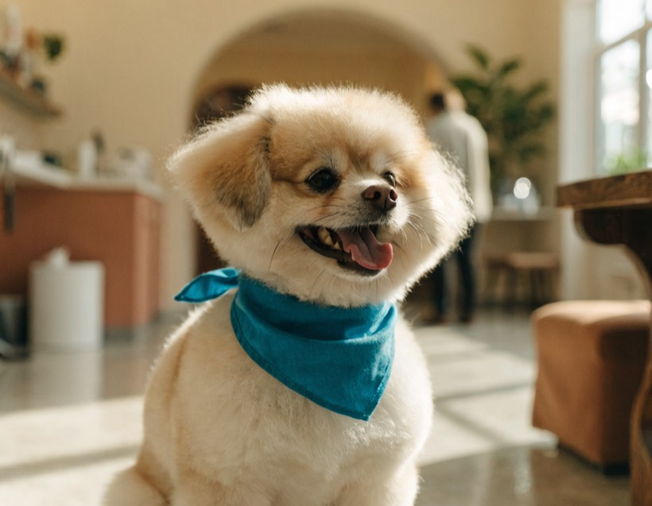
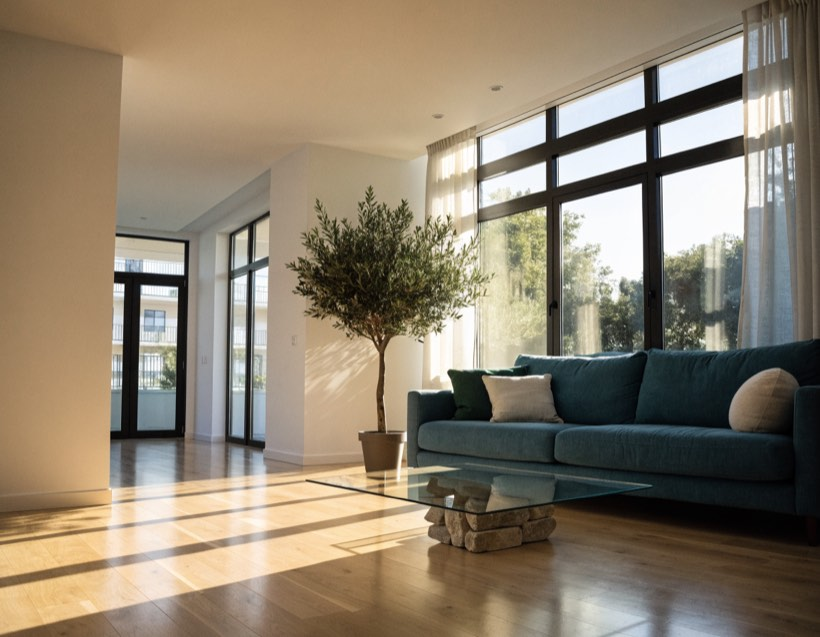
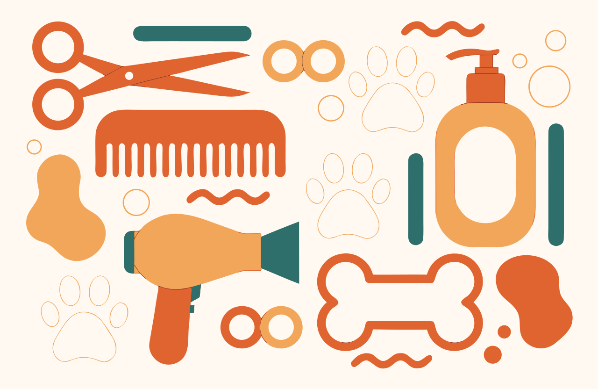
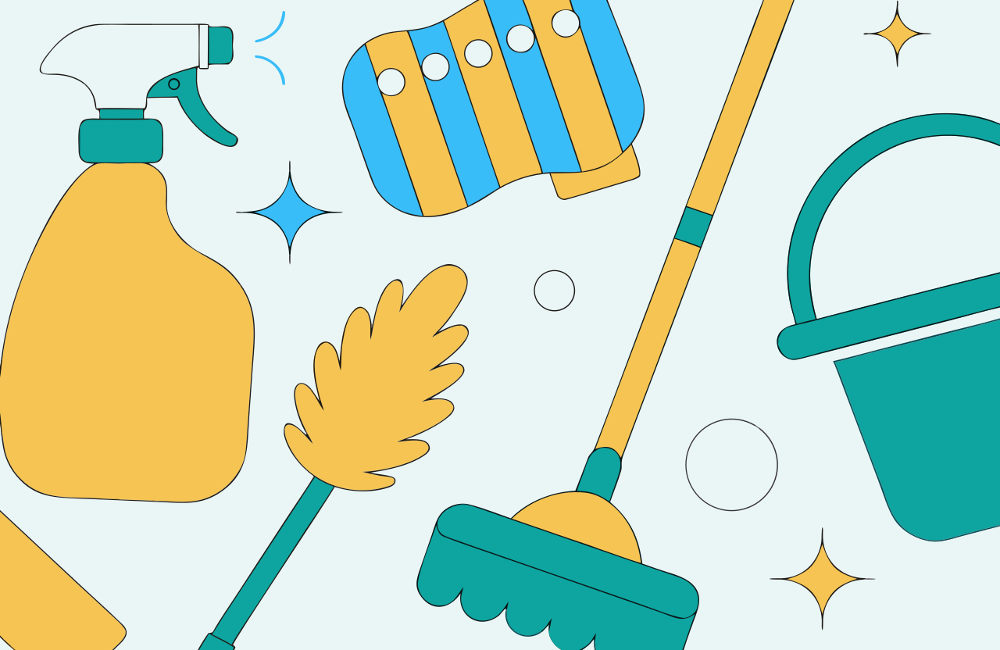

# Local Service Landing Pages with AI-Generated Visuals

**Jason Teixeira** — TripleTen AI Automation, Project 4

Two landing pages for two different local businesses, each with a single clear goal, AI-generated visuals, working call-to-action modals, and a testimonial section. Both are built and published in Lovable.dev, and everything is linked below.

## Live pages (published)

| Service | Goal | Live link |
|---|---|---|
| 🐾 Bark & Bubbles — dog grooming | Book appointments online | https://bark-and-bubbles-book.lovable.app |
| ✦ Sweeplight — home cleaning | Collect quote requests | https://sweeplight-sparkle-clean.lovable.app |

**Submission document (Google Doc, TripleTen template):**
https://docs.google.com/document/d/1im0pbWB-wZnNxE0zEi6amlDcXRxB6faySBNJqVbFKD0/edit

---

## Case 1 — Dog Grooming: "Bark & Bubbles"

**Business goal:** get customers to book grooming appointments online.



The whole page is built around one action: booking. The "Book an appointment" button sits in the nav, the hero, and the closing section, so it's never more than a click away no matter where you've scrolled to. Clicking it opens a short booking form right on the page instead of sending you somewhere else, which is usually where people give up. I leaned into the things a nervous pet owner actually cares about — the cage-free promise, reviews from real-sounding customers with their dogs' names, and an easy cancellation policy. The AI hero photo of a freshly groomed pup sets the mood in a second, and the services and pricing answer the "what do I get and what does it cost" question before it turns into a reason to leave.

## Case 2 — Home Cleaning: "Sweeplight"

**Business goal:** collect service requests / quote inquiries.



Cleaning is a "what's this going to cost me" decision, so the page is organized around getting a quote with as little friction as possible. The main button everywhere says "Get a free quote," and it opens a two-minute form instead of forcing a phone call, which is where a lot of people bail. The three-step "how it works" section quietly handles the worry that getting a quote is a hassle, and the pricing tiers give a ballpark so the real number isn't a surprise later. Since you're letting someone into your home, I put the background-check and satisfaction-guarantee language near the top and backed it with reviews from named customers. The AI image of a bright, spotless living room shows the result you're paying for right away.

---

## AI-generated visuals

Every image on both pages is AI-generated. Each page has an AI hero photo plus AI-generated portrait avatars for the testimonials, and each business also has a flat-vector "tools" banner in a second style:

| Dog grooming banner | Home cleaning banner |
|---|---|
|  |  |

All images carry descriptive alt text so the pages stay accessible.

## What's in this folder

```
local-service-landing-pages/
├── README.md                     ← this submission overview
├── pages/
│   ├── dog-grooming.html         ← self-contained source (AI images embedded)
│   └── home-cleaning.html        ← self-contained source (AI images embedded)
└── assets/
    ├── dog-grooming-hero.jpg     ├── dog-grooming-banner.svg
    ├── home-cleaning-hero.jpg    └── home-cleaning-banner.svg
```

The two files in `pages/` are the full, standalone source for each landing page — open either one in a browser and it runs offline, images and all.

## Submission checklist

- [x] Two distinct services chosen (dog grooming + home cleaning)
- [x] Two landing pages built in Lovable.dev and published
- [x] Testimonial section on each page (three short quotes, avatars with alt text)
- [x] At least one AI-generated image per page (hero photo + avatars + vector banner)
- [x] Clear CTAs aligned with each business goal (book / get a quote)
- [x] Working CTA behavior — every button opens a modal form and confirms; nav links smooth-scroll; no dead buttons
- [x] Published links + 3–5 sentence rationale per case, in the Google Doc

## Bonus challenges (all three done)

- [x] **Multiple AI visuals in different styles** — each live page pairs a photographic AI hero with a flat-vector AI illustration banner of the service's tools, so two distinct AI styles appear on every page.
- [x] **Experiment with different CTAs** — three CTA copy variants were written and judged per page; the strongest shipped. Full writeup: [CTA-EXPERIMENT.md](CTA-EXPERIMENT.md).
- [x] **Extra sections that support the goal** — services, pricing tiers, an FAQ on the grooming page and a "how it works" flow on the cleaning page, plus trust cues (guarantees, cage-free / background-checked promises, star ratings).
